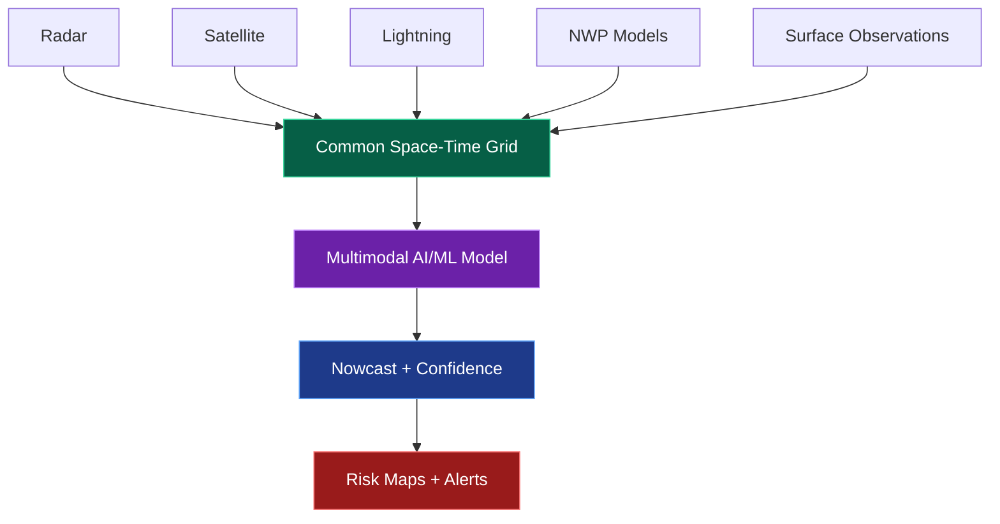
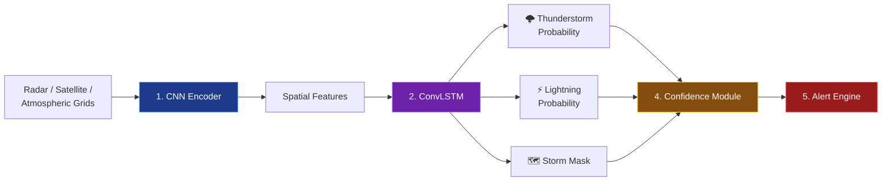
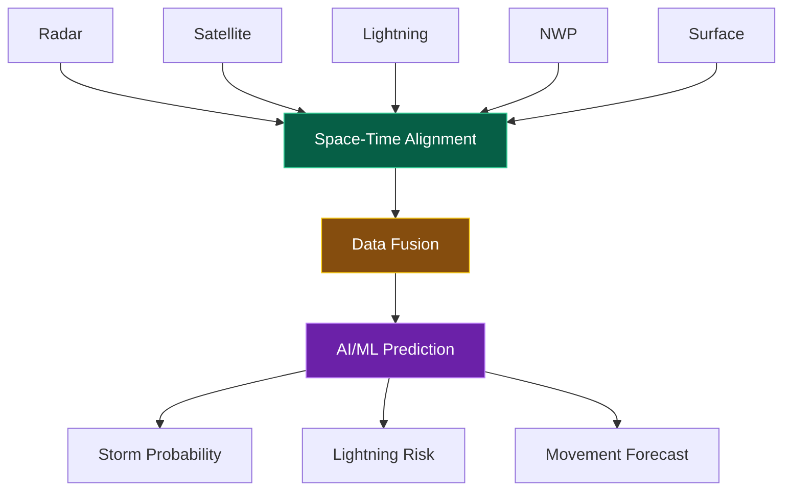
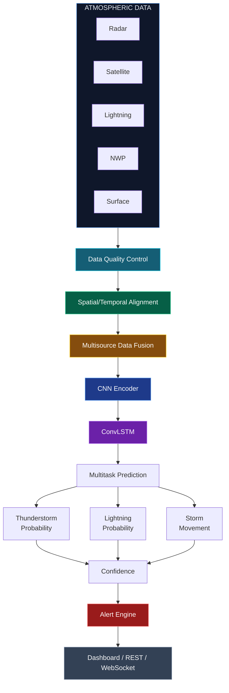
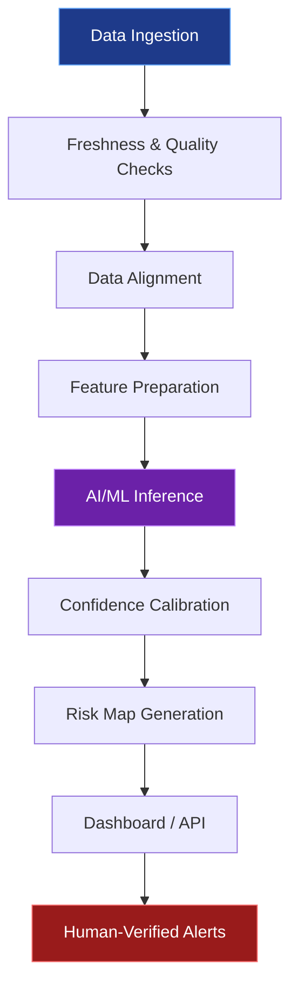

 

**AI/ML-powered multi-source weather nowcasting platform for rapidly evolving thunderstorms and lightning**

 

---

## 📑 Contents

[Smart India Hackathon](#-smart-india-hackathon) · [Overview](#%EF%B8%8F-overview) · [Problem](#-problem) · [Proposed Solution](#-proposed-solution) · [AI/ML Architecture](#-aiml-architecture) · [Data Cube](#%EF%B8%8F-unified-spatiotemporal-data-cube) · [Outputs](#-prediction--alert-outputs) · [System Architecture](#%EF%B8%8F-system-architecture) · [Tech Stack](#%EF%B8%8F-technology-stack) · [Operations](#-operational-workflow) · [Validation](#-validation-strategy) · [Challenges](#%EF%B8%8F-key-challenges) · [Impact](#-impact) · [Innovation](#-innovation--uniqueness) · [Status](#-current-prototype-status) · [Roadmap](#-future-roadmap) · [References](#-research-foundation)

---

## 🚨 Smart India Hackathon

| Parameter | Details |
|---|---|
| **Problem Statement ID** | 26072 |
| **Problem Statement** | AI/ML based Nowcasting of Thunderstorm and Lightning using atmospheric observation including multiple radars, satellite, lightning and model data |
| **Theme** | Disaster Management |
| **Category** | Software |
| **Team ID** | 137242 |
| **Team Name** | SAVITR |

---

## 🌩️ Overview

Thunderstorms and lightning can develop, intensify, and move rapidly, requiring frequently updated and localized forecasts.

However, atmospheric observations come from multiple sources, including **radars, satellites, lightning networks, Numerical Weather Prediction (NWP) models, and surface observations**, and these sources differ in:

- Spatial resolution
- Temporal update frequency
- Data format
- Observation quality
- Availability and latency

SAVITR addresses this fragmentation through an **AI/ML-powered multi-source nowcasting platform** that continuously aligns and fuses atmospheric observations on a common space-time grid.

The system produces short-term predictions for:

- 🌩️ Thunderstorm probability
- ⚡ Lightning probability
- 🌀 Storm movement
- 🗺️ Future storm regions
- 📊 Prediction confidence
- 🚨 Regional risk alerts

---

## 🎯 Problem

Traditional weather-monitoring workflows often require multiple weather-data platforms to be monitored independently.

This creates several challenges:

- Fragmented atmospheric observations
- Different spatial and temporal resolutions
- Missing or delayed observations
- Difficulty combining radar, satellite and lightning information
- Limited localized short-term prediction
- High uncertainty during rapidly evolving storms
- Difficulty converting raw observations into actionable risk information

SAVITR aims to convert these fragmented observations into a **single unified decision-support system**.

---

## 💡 Proposed Solution

SAVITR follows a unified pipeline:

The system combines multiple atmospheric data sources into a common spatiotemporal representation.

### Multi-Source Data Fusion

The platform integrates:

The prototype currently targets short-term horizons:

**Current → +10 min → +20 min → +30 min**

---

# 🧠 AI/ML Architecture

## Input Data

| Source | Features |
|---|---|
| 📡 **Radar** | Reflectivity · Echo structure · Intensity trends · Storm motion |
| 🛰️ **Satellite** | Cloud-top temperature · Cooling rate · Cloud texture · Cloud movement |
| ⚡ **Lightning** | Strike density · Spatial clustering · Temporal growth |
| 🌦️ **NWP & Surface** | Atmospheric instability · Humidity · Pressure · Wind · Temperature · Rainfall |

---

## 🔬 Model Pipeline

The system uses a spatiotemporal deep-learning architecture.

### 1. CNN Encoder

Extracts spatial atmospheric features from each observation timestep.

### 2. ConvLSTM

Learns how storms:

- Grow
- Decay
- Move
- Change over time

ConvLSTM is used as an established baseline for spatiotemporal weather nowcasting because it jointly models spatial and temporal relationships.

### 3. Multitask Prediction Heads

The model generates multiple outputs: Thunderstorm Probability, Lightning Probability and Storm Mask.

### 4. Confidence Module

Produces:

- Calibrated probabilities
- Prediction confidence
- Uncertainty information

### 5. Alert Engine

High-risk grid cells can trigger configurable alerts.

---

# 🗺️ Unified Spatiotemporal Data Cube

Instead of treating weather layers independently, SAVITR creates a **unified spatiotemporal representation**.

This allows the model to jointly learn relationships between different atmospheric observations.

---

# 🚨 Prediction & Alert Outputs

SAVITR is designed to generate actionable outputs rather than only raw weather measurements.

| Output | |
|---|---|
| 🌩️ | Thunderstorm probability maps |
| ⚡ | Lightning probability maps |
| 🌀 | Storm movement tracks |
| 🗺️ | Future storm masks |
| 📊 | Confidence layers |
| 🚨 | High-risk regional alerts |

---

# 🏗️ System Architecture

---

# 🛠️ Technology Stack

| Layer | Technologies |
|---|---|
| **AI / Data Processing** | Python · PyTorch · NumPy · Xarray · GeoPandas |
| **Backend** | FastAPI · PostgreSQL · PostGIS · REST APIs · WebSocket APIs |
| **Frontend** | React / Next.js · Leaflet or MapLibre |
| **Deployment** | Docker · Automated data ingestion · GPU-enabled inference |

---

# 🔄 Operational Workflow

SAVITR is designed around an automated operational pipeline:

Automated ingestion checks data freshness, quality and timestamps before inference.

Scheduled inference generates updated prediction maps for each available observation cycle.

> [!IMPORTANT]
> The model acts as **decision support**, rather than replacing official warnings issued by meteorological authorities.

---

# 🧪 Validation Strategy

SAVITR proposes validation using multiple weather-nowcasting metrics:

| Metric | Purpose |
|---|---|
| **POD** | Probability of Detection |
| **FAR** | False Alarm Ratio |
| **CSI** | Critical Success Index |
| **Brier Score** | Probabilistic forecast quality |
| **Spatial Error** | Location accuracy of predicted storms |
| **Latency** | Time required to generate updated predictions |

The system is intended to be validated progressively from offline historical data toward real-time operation.

---

# 📈 Development Strategy

The proposed development path is:

Initial development can use historical observations before integrating continuous real-time data feeds.

Baseline models include:

- Persistence
- Storm extrapolation
- Single-source models

These provide comparison points for the multimodal CNN–ConvLSTM model.

---

# ⚠️ Key Challenges

The system addresses several real-world challenges:

- Missing observations
- Delayed observations
- Noisy measurements
- Inconsistent data sources
- Different spatial resolutions
- Different update frequencies
- Limited continuous real-time data access
- Severe-event scarcity
- Class imbalance
- Storm displacement
- False alarms
- Prediction uncertainty
- High computational requirements

### Mitigation Strategies

SAVITR incorporates:

- Missing-source masks
- Fallback models
- Quality-control pipelines
- Common space-time alignment
- Weighted loss functions
- Event-based sampling
- Probability calibration
- Confidence layers

---

# 🌍 Impact

| Sector | Support provided |
|---|---|
| 🚑 **Disaster Management** Localized risk maps can support | Emergency preparedness · Resource positioning · Rapid response planning |
| 🧑‍🤝‍🧑 **Public Safety** Timely alerts can help | Outdoor workers · Communities · Event organizers · Field personnel *move toward safer locations* |
| ✈️ **Aviation & Transport** Storm tracking can support | Safer routing · Ground-operation planning · Short-term operational decisions |
| 🌾 **Agriculture** Near-term warnings can help protect | Field workers · Livestock · Weather-sensitive agricultural activities |
| 🔌 **Utilities & Infrastructure** Localized weather intelligence can support | Maintenance planning · Infrastructure protection · Operational planning |

---

# 💰 Economic & Strategic Benefits

SAVITR can:

- Reduce manual monitoring of multiple weather-data platforms
- Enable faster identification of high-risk regions
- Reduce prototype-development costs through an open-source stack
- Deliver predictions through APIs
- Support dashboards, mobile applications and control rooms
- Scale to additional regions and sensors
- Support additional models and alert channels
- Reduce avoidable disruption to agriculture, transport and infrastructure

---

# 🚀 Innovation & Uniqueness

| # | Innovation | Description |
|:-:|---|---|
| 1 | **Unified Spatiotemporal Data Cube** | Instead of independently viewing radar, satellite and lightning layers, SAVITR creates a common representation for joint AI processing. |
| 2 | **Joint Multi-Hazard Prediction** | The system simultaneously predicts thunderstorm probability, lightning probability and storm movement. |
| 3 | **Confidence-Aware Nowcasting** | Predictions are accompanied by calibrated probabilities and uncertainty information. |
| 4 | **Adaptive Data Fusion** | The architecture can continue operating when some observations are missing, delayed or inconsistent. |
| 5 | **Modular Architecture** | The system can be extended with new sensors, new geographical regions, new prediction horizons, new AI models and additional alert channels. |

---

# 📊 Current Prototype Status

> **Prototype completion: 40%+**

The current architecture and core technical approach have been defined, with the development pathway progressing from offline model development toward live data ingestion, dashboard visualization and alert generation.

---

# 🔮 Future Roadmap

Planned future improvements include:

- Real-time radar integration
- Real-time satellite data integration
- Real-time lightning data integration
- Continuous NWP data ingestion
- Expanded geographical coverage
- Improved multimodal fusion models
- Advanced uncertainty estimation
- Improved storm tracking
- Real-time dashboard deployment
- Automated alert delivery
- GPU-optimized inference
- Edge/low-latency deployment
- Historical-event replay and evaluation
- Integration with official meteorological data feeds

---

# 📚 Research Foundation

The project is supported by research in:

**Radar Nowcasting • Deep Learning • Thunderstorms • Lightning • Multimodal AI**

<b>Key References (15)</b>

 

1. Shi, X., Chen, Z., Wang, H., Yeung, D.-Y., Wong, W.-K. & Woo, W.-C. (2015). *Convolutional LSTM Network: A Machine Learning Approach for Precipitation Nowcasting.* NeurIPS, 802–810.

2. Ayzel, G., Scheffer, T. & Heistermann, M. (2020). *RainNet v1.0: A Convolutional Neural Network for Radar-Based Precipitation Nowcasting.* Geoscientific Model Development, 13, 2631–2644.

3. Trebing, K., Stańczyk, T. & Mehrkanoon, S. (2021). *SmaAt-UNet: Precipitation Nowcasting Using a Small Attention-UNet Architecture.* Pattern Recognition Letters, 145, 178–186.

4. Ravuri, S., Lenc, K., Willson, M. et al. (2021). *Skilful Precipitation Nowcasting Using Deep Generative Models of Radar.* Nature, 597, 672–677.

5. Yao, S., Chen, H., Thompson, E. J. & Cifelli, R. (2022). *An Improved Deep Learning Model for High-Impact Weather Nowcasting.* IEEE JSTARS, 15.

6. Leinonen, J., Hamann, U. & Germann, U. (2022). *Seamless Lightning Nowcasting with Recurrent-Convolutional Deep Learning.* AI for the Earth Systems, 1(4).

7. Leinonen, J., Hamann, U., Germann, U. & Mecikalski, J. R. (2022). *Nowcasting Thunderstorm Hazards Using Machine Learning: The Impact of Data Sources on Performance.* Natural Hazards and Earth System Sciences, 22, 577–597.

8. Miao, K. et al. (2020). *Multimodal Semisupervised Deep Graph Learning for Automatic Precipitation Nowcasting.* Mathematical Problems in Engineering.

9. Wang, T. et al. (2020). *A Deep Learning Network for Cloud-to-Ground Lightning Nowcasting with Multisource Data.* Journal of Atmospheric and Oceanic Technology, 37, 927–942.

10. Ortland, S. M., Pavolonis, M. J. & Cintineo, J. L. (2023). *ThunderCast: A Deep-Learning Model for Thunderstorm Nowcasting in the United States.* AI for the Earth Systems.

11. Leinonen, J., Hamann, U., Sideris, I. V. & Germann, U. (2023). *Thunderstorm Nowcasting with Deep Learning: A Multi-Hazard Data Fusion Model.* Geophysical Research Letters, 50.

12. Zhang, Y., Long, M., Chen, K. et al. (2023). *Skilful Nowcasting of Extreme Precipitation with NowcastNet.* Nature, 619, 526–532.

13. Guo, S. et al. (2023). *3D-UNet-LSTM: A Deep Learning-Based Radar Echo Extrapolation Model for Convective Nowcasting.* Remote Sensing, 15, 1529.

14. Fan, D. et al. (2024). *Physically Explainable Deep Learning for Convective Initiation Nowcasting Using GOES-16 Satellite Observations.* AI for the Earth Systems.

15. Harnist, B., Pulkkinen, S. & Mäkinen, T. (2024). *DEUCE v1.0: A Neural Network for Probabilistic Precipitation Nowcasting with Aleatoric and Epistemic Uncertainties.* Geoscientific Model Development, 17, 3839–3866.

---

# 🏆 Smart India Hackathon

**Problem Statement:** 26072
**Theme:** Disaster Management
**Category:** Software
**Team:** SAVITR
**Team ID:** 137242

---

## 🔗 Project Repository

[GitHub Repository](https://github.com/utsav-a11y/SIH-AIML-Based-Nowcasting-of-thunderstorm)

---

## 📌 Disclaimer

SAVITR is a research and prototype decision-support system. Its predictions are intended to assist analysis and preparedness and should not replace official warnings or advisories issued by authorized meteorological and disaster-management agencies.
